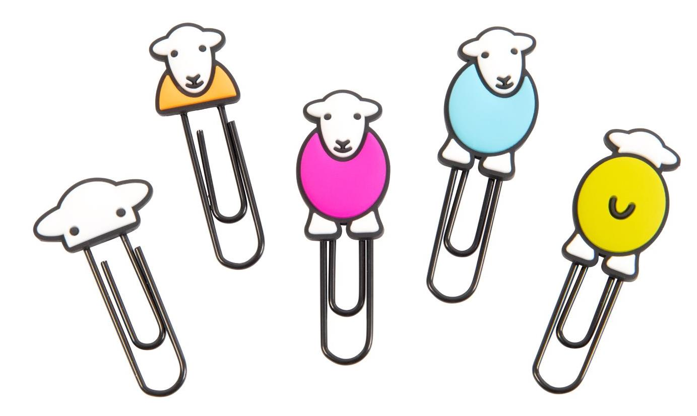
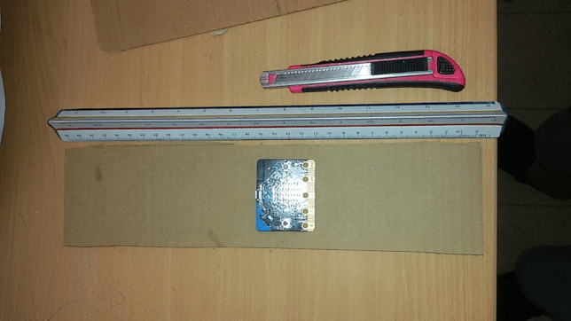

# MagicBookmark

###@activities false
###@explicitHints true

## introduction@fullscreen

בפרויקט זה נכין  קוד לסמניית קסם שעוקבת אחרי הקריאה שלנו


## Step 1 @fullscreen
הכינו שלושה משתנים:
משתנה  כוח מגנטי, משתנה ניקוד קריאה ומשתנה סיכום
השתמשו ב ``||variables: set magnetic force  ||``  ןהגדירו ערך ראשוני ל-0

```blocks
let magnetic_force = 0
let reading = 0
let total = 0

```
## Step 2
אפסו את המצפן
השתמשו ב: ``||input:calibrateCompass()||``

דוגמה
```blocks
input.calibrateCompass()

```
##step 3
מתחת לאתחול המצפן הוסיפו לבנה שמגדירה ערך כוח מגנטי לפי המצפן 
ובערך אבסולטי של חוזק המגנט
השתמשו ב:
``||Math:abs()||``

##~tutorialhint
רמז
```blocks
magnetic_force = Math.abs(input.magneticForce(Dimension.Strength))
```
## Step 4 
חברו הכל יחד
```blocks

let magnetic_force = 0
let reading = 0
let total = 0
input.calibrateCompass()
magnetic_force = Math.abs(input.magneticForce(Dimension.Strength))

```
## Step 5
הסמנייה שלנו תבדוק כמה זמן אנחנו קוראים לשם כך נשתמש בלולאת חזור תמיד
הכניסו לתוך לולאת החזור 
הכניסו  לבנת  "הראה מספר" 
השתמשו ב``||basic: showNumber()||`` והזינו ערך משתנה total
``||variable: total||`` 

##Step 6
נשתמש בשלושה תנאים כדי לבדוק האם הסמניה סגורה או פתוחה
התנאי הראשון בודק האם יש מגנט בסביבה
לשם כך צרו משתנה נוסף קראו לו "מגנט כאן?" 
אם החוזק שלו גדול מ-100 סימן שיש משיכה או דחיה והסמניה סגורה
השתמשו בלבנת 
``||variables: set ||``  השתמשו ב ןהגדירו את הערך לתנאי 
``||logic: magnetic_force > 100||``
העזרו ברמז
```blocks
basic.showNumber(total)
magnet = magnetic_force > 100	
```
## step 7
בשלב הבא הקוד יבדוק האם הסמניה פתוחה[מצב קריאה]
ואם כן, כמה זמן היא פתוחה נשתמש הפעם בלבנת תנאים
``||ligic: if true then else||``

## Step 8
כתבו בעצמכם:
כאשר נלחץ כפתור A
המסך יראה פרצוף עצוב
והודעה של מצב " נא לקרוא"
אחרת
משתנה נקוד + 1
  ל חצי שנייה השהייה
ותמונת "לב" 
העזרו ברמז
```blocks
if (input.buttonIsPressed(Button.A)) {
        basic.showIcon(IconNames.Sad)
        basic.showString("read")
    } else {
        reading += 1
        basic.pause(500)
        basic.showIcon(IconNames.Heart)
} 
```

## Step 9
התנאי האחרון מופיע בדיוק מתחת לתנאי הקודם
כאן הוסיפו לבנת ``||logic:if  true >  then||`` 
שבודקת האם סכום הנקודות גדול מ-600
זה אמור להראות כך
```blocks
if (reading  > 600) {
       
}
```
## Step 10
אם עברו יותר מ-5 דקות אז נוספת נקודה לסכום הכולל
השתמשו בלבנות המשתנה המתאים 
למשל: ``||variable:change ||``
עכשיו צריך גם לאפס את מדד הקריאה
הגדירו את משתנה הקריאה ל-0
```blocks
if (reading  > 600) {
        total += 1
        reading = 0
}
```
 @boardname@ הסתכלו בסימולציה  ובדקו מה קורה למשתנים בלחיצה על  כפתור A
## Step 14

 @boardname@ לחצו `|download|` כדי להעביר את הקוד ללוח המיקרו:ביט

